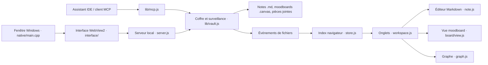
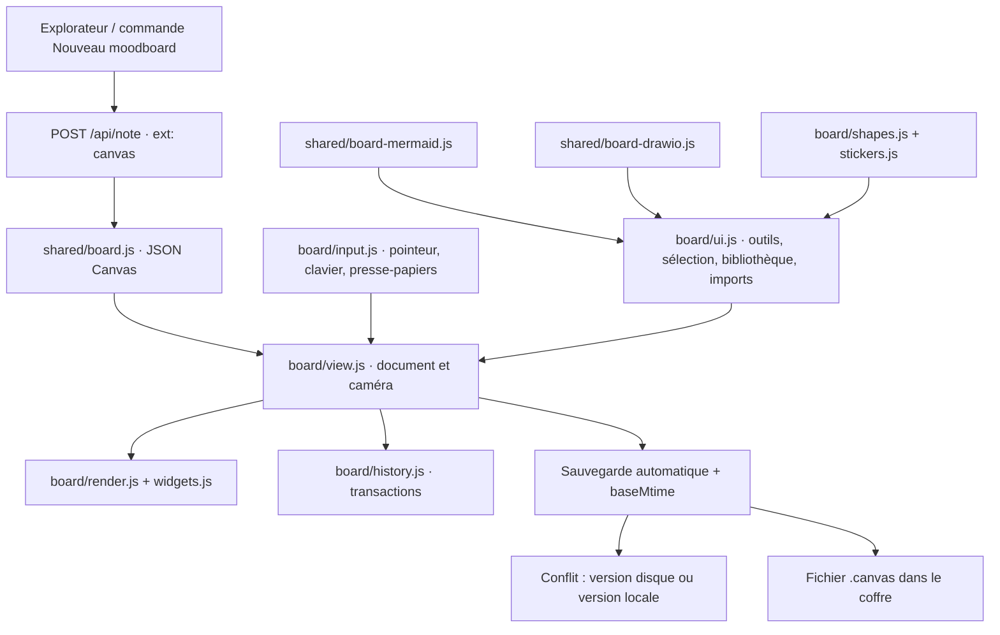

# Opale : cartographie et reprise du moodboard

État vérifié le 5 octobre 2026 dans `C:\Users\boque\Desktop\opale`.
Remote : `https://github.com/zaalis/opale.git`. Base Git : `e8c03de` sur `main`.
Le dossier `Documents\Opale` contient les coffres de notes ; le code de l'application est sur le Bureau.

## Architecture de l'application

| Zone | Fichiers | Responsabilité |
| --- | --- | --- |
| Démarrage et événements | `interface/js/main.js`, `lib/appdata.js` | Ouvrir le coffre, charger l'interface, synchroniser l'index ; configuration locale. |
| Fenêtre Windows | `native/main.cpp`, `native/build.bat` | WebView2, fenêtre native, compilation et empaquetage du serveur. |
| API locale | `server.js` | HTTP sur loopback, authentification, création/lecture/écriture, uploads, sessions, MCP. |
| Données du coffre | `lib/vault.js`, `lib/search.js` | Chemins, index, conflits, renommage/déplacement et références, recherche. |
| Format et rendu Markdown | `shared/meta.js`, `shared/markdown.js`, `interface/js/renderer.js` | Types de fichiers, liens, métadonnées, rendu et coloration. |
| Socle de l'interface | `core.js`, `store.js`, `layout.js` | API navigateur, DOM, dialogues, menus, index, panneaux et thème. |
| Navigation | `workspace.js`, `explorer.js`, `commands.js` | Onglets, historique, création de fichiers, arborescence et raccourcis. |
| Notes et médias | `note.js`, `editing.js`, `images.js`, `links.js` | Édition, enregistrement, pièces jointes, placement d'images et liens. |
| Panneaux et graphe | `panels.js`, `graph.js`, `settings.js`, `launcher.js` | Rétroliens, recherche, graphe, paramètres, choix du coffre. |
| Moodboards | Voir ci-dessous | Document `.canvas`, interactions et bibliothèque d'éléments. |

Les noms d'interface du tableau sont relatifs à `interface/js/`.

## Ce que Claude avait laissé

Le commit `e8c03de` était bien le dernier commit du dépôt. Les fichiers du moodboard étaient encore non suivis ou modifiés localement, sans commit supplémentaire.

- Présents : modèle JSON Canvas, géométrie et dessins ; reconnaissance du type `board` ; création côté serveur ; références mises à jour lors des déplacements ; outils MCP ; historique ; rendu ; widgets ; vue ; interactions ; catalogues ; imports Mermaid et draw.io.
- Absents : `board/ui.js`, styles du moodboard, scripts partagés dans la page, ouverture des `.canvas` dans les onglets, commandes et boutons de création.
- Bloquants : redéclaration d'un identifiant dans `view.js` (erreur de syntaxe) et chevauchement d'un sous-graphe Mermaid avec un nœud extérieur (1 test en échec sur 69).
- L'autorisation caméra avait été ajoutée dans la fenêtre native. Aucune interface de prise de photo n'était présente ; cette fonction ne doit pas être considérée comme livrée.

## Circuit d'un moodboard

| Module | Rôle |
| --- | --- |
| `shared/board.js` | Modèle normalisé, import/export JSON Canvas, références, géométrie, points de connexion, tracés, export des tâches. |
| `shared/board-mermaid.js` | Lecture de flowchart/graph, mindmap et sequenceDiagram ; rendu SVG ou conversion en éléments modifiables. Ce n'est pas l'implémentation complète de Mermaid. |
| `shared/board-drawio.js` | Lecture XML draw.io, pages multiples et données compressées ; conversion des cellules, formes et liens. Les approximations donnent des avertissements. |
| `board/history.js` | Transactions, annulation/rétablissement, ordre et métadonnées. |
| `board/view.js` | Chargement, caméra, rendu incrémental, édition de texte, sauvegarde et changements externes. |
| `board/input.js` | Sélection, déplacement, repères, redimensionnement/rotation, flèches, stylet, gomme, lasso, raccourcis et dépôt de fichiers. |
| `board/render.js` | Texte, pense-bêtes, formes, dessins, médias, notes, fichiers, cadres, code et décorations. |
| `board/widgets.js` | Tableau, Kanban, carte mentale, tâches, cartes recto-verso/profil, planning, commentaires, Mermaid, sondage, roue, échelle et activités. |
| `board/ui.js` | Outils, propriétés, poignées, bibliothèque recherchable, calques, dialogues, imports et exports `.canvas` / plan Markdown. |
| `interface/css/board.css` | Surface, contrôles, éléments et widgets avec les variables du thème clair/sombre. |
| `board/shapes.js`, `board/stickers.js` | 183 formes, 702 émojis, 52 autocollants, 245 icônes. |

## Reprise effectuée

- Branchement des moodboards aux onglets et à leur historique, restauration de la caméra et notification des changements de fichier.
- Bouton dans l'explorateur, menus de création et commande « Nouveau moodboard » ; action sur l'écran de nouvel onglet.
- Barre d'outils, zoom, indicateur de sauvegarde, sélection, poignées, propriétés, duplication, groupes, verrouillage et ordre des éléments.
- Bibliothèque recherchable, choix des fichiers du coffre, ajout par dépôt ou collage, import Mermaid/draw.io/Canvas, modification des notes avec contrôle de conflit.
- Calques, édition Mermaid et conversion, commentaires, exports du document et des tâches.
- Correction du chevauchement Mermaid, respect de l'option des repères magnétiques, suppression des éléments fantômes après annulation d'un geste.
- Sauvegarde : attente de la requête courante à la fermeture, délai de reprise sur erreur, protection de la lecture seule et absence de réécriture d'un fichier supprimé.
- Respect du réglage de réduction des animations pour la caméra ; raccourci de groupe réservé au moodboard.

## Vérifications

`npm test` : 69 tests du modèle, des imports, du serveur, du coffre, de Markdown et des outils MCP passent.

`scripts/verify-board-browser.cjs` : test Chrome sans fenêtre, avec un coffre temporaire indépendant. Vérifie création et édition d'un pense-bête, contenu réellement enregistré sur disque, annulation/rétablissement, catalogue de formes et geste de déplacement, imports Mermaid/draw.io, rendu de tous les types, restauration des onglets, conflit avec une modification externe, reprise après erreur HTTP et intégrité d'un fichier endommagé ouvert en lecture seule. Aucune erreur JavaScript non gérée dans ce parcours.

Le script requiert Playwright (localement ou via `NODE_PATH`) et Chrome installé ; `OPALE_TEST_BROWSER` permet de choisir un autre canal disponible.

`npm run build` : compilation de `dist/Opale.exe`, `dist/pickfolder.exe` et empaquetage de `dist/opale-server.exe`.

Le parcours navigateur a aussi été exécuté avec `OPALE_TEST_SERVER=dist/opale-server.exe` : tous les contrôles ci-dessus passent avec les ressources empaquetées. La fenêtre WebView2 native n'a pas fait l'objet d'une interaction automatisée.

## Limites et prochaines extensions

- Les contrôles navigateur ne constituent pas un test physique d'un stylet à pression, d'un écran tactile ou d'un périphérique caméra.
- Les widgets sont rendus, mais tous leurs scénarios détaillés n'ont pas été parcourus manuellement.
- Pas de photomaton, collaboration réseau multi-utilisateur ou export image/PDF livré dans cette reprise.
- Les compteurs et réponses des activités restent locaux au fichier du moodboard.
- La session de vote global et certains réglages avancés des widgets restent à exposer ; le moteur possède déjà une partie de ces données.
- Les ajouts sont locaux. Aucun push Git ni remplacement de l'application installée n'a été effectué.
