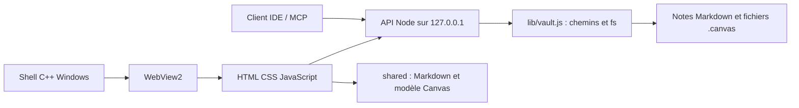
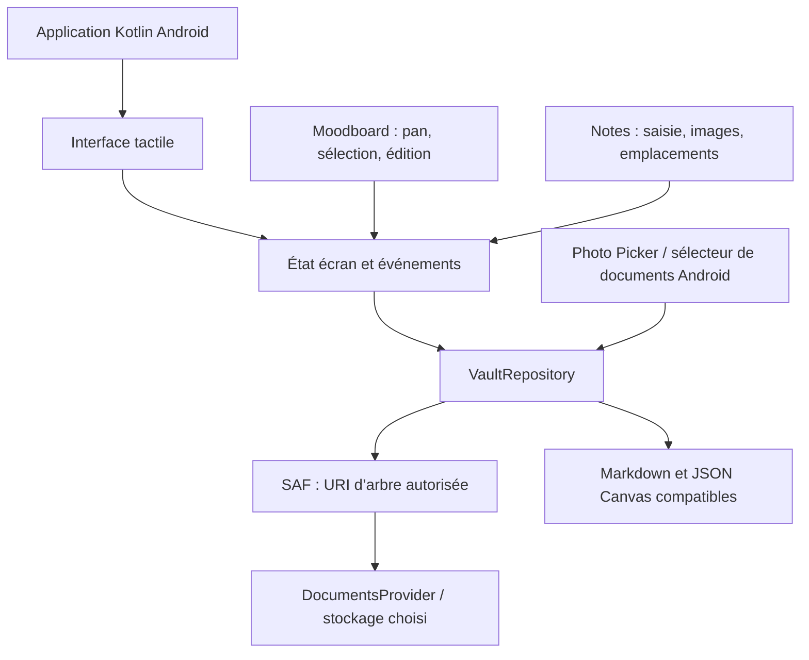

# Cartographie Android d’Opale

> **Étude préalable, conservée pour traçabilité.** Le développement réalisé ensuite suit le choix demandé par l’utilisateur : application native Kotlin/Jetpack Compose. L’état actuel, l’APK et les contrôles sont décrits dans [VALIDATION_ANDROID.md](VALIDATION_ANDROID.md). Les constats ci-dessous décrivent le dossier avant sa migration ; les recommandations hybrides sont dépassées par ce choix natif.

État relevé le 5 octobre 2026 dans `opale android`. Cette note cartographie le portage; elle ne modifie pas le code Windows.

## Résumé

Le dossier nommé `opale android` ne contient pas encore d’application Android. C’est une copie de l’application de bureau Windows : serveur Node.js, interface HTML/CSS/JavaScript, shell C++ avec WebView2, scripts PowerShell et installateur Windows. Aucun projet Gradle, manifeste Android, fichier Kotlin/Java ni APK/AAB n’a été trouvé. Ce dossier n’a pas de dépôt Git; le checkout de référence vérifié est `opale-github-audit`, branche `main`, commit `2150c23`.

Le modèle Opale et les fichiers de notes sont récupérables : Markdown, liens `[[…]]`, pièces jointes, placements d’image écrits dans le Markdown et documents moodboard `.canvas`. Les frontières Windows à remplacer sont le lancement natif, le serveur Node qui accède au disque, le sélecteur de coffre et certains gestes/UI conçus pour souris.

**Le choix technique déterminant est le stockage.** Windows donne au serveur un chemin de fichier qu’il peut passer à Node `fs`. Android donne à l’application une autorisation sur un arbre de documents, représentée par une URI `content://`. Ce n’est pas un chemin de disque à transmettre à `lib/vault.js`; le coffre doit passer derrière une interface de stockage Android, ou être copié dans le stockage privé de l’application.

Pour le comportement que tu as décrit, le contrat tactile est :

- Dans une note, choisir une image avec le sélecteur Android, puis la poser avec un doigt sur un emplacement existant (ou choisir cet emplacement dans une barre d’actions). Conserver les tailles et placements prédéfinis et les écrire dans le Markdown comme aujourd’hui.
- Dans le moodboard, faire glisser le fond avec un doigt pour déplacer la vue; toucher un élément le sélectionne; toucher **Modifier** ouvre ses propriétés. Un geste séparé permet de repositionner un objet; deux doigts peuvent zoomer.

## 1. État réel du dossier

| Partie | État constaté |
| --- | --- |
| Android | Pas de projet Gradle, `AndroidManifest.xml`, Kotlin/Java, Capacitor/Cordova, APK ou AAB. |
| Lancement | `native/main.cpp` et WebView2 démarrent/affichent l’application Windows; `native/build.bat` et `package.json` produisent des binaires `.exe`. |
| Interface | Modules JavaScript et CSS dans `interface/`; le même document HTML charge l’interface et les modèles `shared/`. |
| Serveur et données | `server.js` sert l’interface et l’API locale; `lib/vault.js` accède directement à l’arborescence avec Node `fs`. |
| Moodboard | Modèle, historique, rendu et modules d’interaction existent; le document est enregistré au format `.canvas`. |
| Git | Ce dossier n’a pas de `.git`. Les changements Android futurs devront partir du checkout de référence, pas d’une publication implicite depuis cette copie. |

`docs/CARTOGRAPHIE.md` est une cartographie de l’application Windows et de la reprise du moodboard. Elle décrit utilement les formats et modules existants, mais ne prouve pas la présence d’un port Android.

## 2. Architecture Windows à remplacer

La fenêtre Windows et le serveur ont été conçus ensemble. Le serveur écoute `127.0.0.1`, vérifie l’hôte/origine, choisit le coffre à partir d’un chemin absolu et expose lecture/écriture, fichiers joints, événements, outils MCP et changements de coffre. Le picker de dossier utilise le picker natif Windows/PowerShell. La corbeille et l’ouverture dans l’Explorateur ont également des chemins Windows.

### À conserver autant que possible

- Les fichiers `.md`, les liens internes, le frontmatter, les pièces jointes et les noms de chemins relatifs au coffre.
- La syntaxe de placement d’images existante, par exemple `![[photo.png|left|320]]`; conserver aussi les variantes de position et de taille déjà offertes dans l’interface.
- Les données `.canvas`, le modèle de géométrie, l’historique et les contrats de contenu des éléments. C’est la meilleure voie pour qu’un moodboard Android reste ouvrable sous Windows.
- Les règles de conflit et les opérations métier. Elles devront être découplées du `fs` synchrone avant d’être appelées par une couche Android.
- Le rendu et l’édition JavaScript si l’interface est gardée dans une WebView pendant le premier portage.

### À remplacer ou isoler

- Shell Win32/WebView2, création de processus et gestion de fenêtre.
- `native/pickfolder.cpp`, commandes PowerShell, installateur et raccourcis Windows.
- `lib/vault.js` comme implémentation directe du stockage; `fs.watch` et les chemins OS ne sont pas une abstraction de stockage Android.
- Les appels directs au serveur HTTP et aux événements `EventSource` si l’interface communique avec le stockage Kotlin plutôt qu’avec un serveur local.
- Les interactions uniquement souris : panneaux redimensionnables, clic droit, double-clic et déplacements suivis avec `mousemove`.

## 3. Architecture Android proposée

### Deux sens possibles de « natif »

| Voie | Ce qui est natif | Coût et limite |
| --- | --- | --- |
| **Kotlin Android + interface WebView adaptée** | APK, Activity, stockage SAF, Photo Picker, menus système, cycle de vie, retour système, intégration au clavier. L’écran Opale reste rendu en HTML/CSS/JS. | Réutilise le plus d’interface; il faut adapter `core.js` et son transport API, les gestes web et les limites WebView. C’est une application Android, mais pas une UI entièrement Compose. |
| **Kotlin + Jetpack Compose** | Écrans, contrôles, navigation, saisie et gestes d’interface Android. | Interface et logique d’affichage à réécrire; l’éditeur Markdown live et les nombreux types de widgets du moodboard rendent le port nettement plus grand. |

**Recommandation de portage :** démarrer par un hôte Android Kotlin et une couche de stockage Kotlin/Saf, en gardant l’interface Web pour préserver le comportement actuel. Prévoir une frontière claire entre UI et dépôt de données pour migrer ensuite une vue à la fois vers Compose si « natif » signifie aussi une interface sans WebView. Ne pas lancer un simple emballage Android du serveur Windows : le picker, le stockage et les interactions resteraient bloqués ou incomplets.

Compose est le choix officiellement recommandé pour les nouvelles interfaces Android et s’intègre bien à un état d’écran séparé des données. Les gestes tactiles doivent suivre les sémantiques des contrôles quand elles suffisent, et ne descendre au traitement pointeur personnalisé que pour la surface du moodboard. Voir la [recommandation d’architecture Android](https://developer.android.com/topic/architecture/recommendations), la [documentation Compose sur les gestes](https://developer.android.com/develop/ui/compose/touch-input/pointer-input/understand-gestures) et la [couche UI Compose](https://developer.android.com/develop/ui/compose/architecture).

## 4. Stockage du coffre et import d’images

### Coffre choisi par l’utilisateur

Pour ouvrir un coffre Obsidian existant sans en copier tout le contenu, demander à l’utilisateur de choisir son dossier via Storage Access Framework (`ACTION_OPEN_DOCUMENT_TREE`). Enregistrer l’autorisation persistante accordée pour retrouver le coffre après fermeture/redémarrage. Android 11 et versions suivantes restreignent notamment la sélection de certaines racines, `Download` et dossiers système; l’application ne doit pas supposer qu’elle pourra parcourir tout le stockage. Voir le [guide SAF Android](https://developer.android.com/training/data-storage/shared/documents-files).

Il faudra définir un contrat Kotlin asynchrone avec des chemins relatifs Opale, par exemple : ouvrir/lister, lire, écrire, renommer/déplacer, supprimer vers corbeille Opale, joindre une pièce, vérifier `mtime`/conflit, indexer et rafraîchir. L’implémentation Android résout chaque chemin relatif à partir de l’URI d’arbre et utilise `ContentResolver`/`DocumentsContract`; elle ne convertit jamais cette URI en `java.io.File` en supposant un chemin.

`fs.watch(root, { recursive: true })` n’a pas de remplacement direct garanti pour tous les fournisseurs SAF. Prévoir une stratégie de rafraîchissement et de comparaison de métadonnées; valider les capacités de renommage, suppression et écriture avec stockage local, carte SD et fournisseur cloud pris en charge. La stratégie d’écriture atomique actuelle devra également être adaptée et vérifiée par fournisseur.

### Photos et fichiers joints

- Utiliser Android Photo Picker pour une image de la galerie; `PickVisualMedia` donne accès au média sélectionné sans demander l’accès général à la photothèque. Utiliser le sélecteur de documents pour les autres fichiers. Documentation : [Photo Picker Android](https://developer.android.com/training/data-storage/shared/photo-picker).
- Copier le contenu choisi vers le dossier de pièces jointes du coffre avant d’insérer le lien Markdown. Ne pas conserver seulement une URI vers la galerie : le fichier pourrait ne plus être accessible ou ne pas suivre le coffre lors d’une ouverture sur Windows.
- Préserver l’alignement, les gabarits de taille et les zones de dépôt déjà définis. Pendant le geste, afficher la zone cible, autoscroller près du bord de la note, annuler proprement sur `pointercancel`, puis écrire le placement dans le Markdown.
- Pour la taille des commandes tactiles, viser au moins 48 dp par cible interactive; agrandir la zone de réponse autour des petites poignées sans rendre les icônes visuellement énormes. Vérifier aussi les marges système et le clavier. Sources : [cibles tactiles accessibles Compose](https://developer.android.com/develop/ui/compose/accessibility/api-defaults), [insets Compose](https://developer.android.com/develop/ui/compose/system/insets).

Dans l’interface actuelle, sélectionner une image ouvre un `<input type=file>`. Si elle reste dans WebView, Android doit implémenter `WebChromeClient.onShowFileChooser`; la sélection doit ensuite transférer l’image au dépôt SAF. Si les appels passent par une passerelle JavaScript, réserver cette passerelle au contenu Opale de confiance, avec des origines autorisées; Android recommande les mécanismes WebMessage modernes plutôt que d’exposer une interface générale par `addJavascriptInterface`. Sources : [sélecteur de fichier WebView](https://developer.android.com/reference/android/webkit/WebChromeClient.html), [bridge JS natif](https://developer.android.com/develop/ui/views/layout/webapps/native-api-access-jsbridge), [chargement local sécurisé dans WebView](https://developer.android.com/develop/ui/views/layout/webapps/load-local-content).

## 5. Parcours tactiles visés

| Zone | Comportement existant | Contrat Android à appliquer |
| --- | --- | --- |
| Note | Modes live/source/lecture; le mode live passe un bloc en édition après une pression souris. | Garder les modes et le contenu Markdown; utiliser clavier/IME Android, conserver le curseur et le focus après réaffichage, éviter qu’un tap simple lance le défilement ou déplace l’image. Mettre l’ajout d’image dans une commande visible. |
| Image dans une note | Préréglages de taille/position existent; poignée de redimensionnement en Pointer Events, déplacement du corps d’image en événements souris. | Choisir une image nativement; tap = sélectionner et afficher les actions; glisser avec un doigt vers une case prédéfinie; cibles de poignée agrandies; offrir aussi le choix de case par bouton/menu. |
| Fond du moodboard | Outil `select` par défaut; le vide produit un rectangle; le pan requiert l’outil `hand`, Space ou bouton central; zoom à la molette. | Un doigt sur le fond déplace la vue; tap sur élément = sélection seule; pincement à deux doigts = zoom; conserver une commande visible pour changer d’outil. |
| Élément du moodboard | Un glissement commencé sur l’élément le déplace; double-clic ou Entrée/F2 lance l’édition. | Un tap sélectionne sans modifier; le panneau d’inspection offre **Modifier**. Le déplacement de l’objet est une action distincte, avec état actif et bouton Annuler/Terminé. Ne pas dépendre du double-clic. |
| Panneaux et outils | Barres compactes, poignée de redimensionnement souris, cibles de 10–36 px. | Sur téléphone, panneaux ouvrables/fermables et fiche d’actions en feuille basse; 48 dp minimum par cible, espaces suffisants, zones de gestes système libres. Adapter la navigation en rail/panneaux sur tablette. |

Le bouton **Modifier** est déjà présent dans l’inspecteur du moodboard. Le plus grand changement est donc la séparation entre navigation de la surface, sélection d’objet, déplacement d’objet et édition. L’interface Web actuelle utilise déjà Pointer Events sur la surface et `touch-action:none`, mais ce CSS empêche les gestes natifs du navigateur : pan et zoom doivent être gérés explicitement.

### Points de code qui motivent ces adaptations

- `interface/js/board/input.js` initialise `select`; le pan est choisi seulement pour bouton central, barre d’espace ou outil `hand`; le fond lance marquee et l’objet passe dans le mouvement. Le seuil de mouvement est de 4 px.
- `interface/js/board/ui.js` a déjà l’action **Modifier** dans l’inspecteur.
- `interface/css/board.css` désactive l’action tactile par défaut avec `touch-action:none`; les poignées et outils visibles sont petits pour le doigt.
- `interface/js/note.js` branche plusieurs actions live sur `mousedown`.
- `interface/js/images.js` utilise des pointeurs capturés pour redimensionner, mais `mousemove`/`mouseup` pour déplacer une image dans le texte; le sélecteur de fichiers est HTML.
- `interface/css/app.css` n’a qu’un petit ensemble de règles sous 760 px; l’interface n’a pas encore une architecture de navigation téléphone/tablette.

## 6. Décisions d’architecture à prendre avant le code

1. **Définition de natif :** app Android et services système natifs avec UI Web adaptée, ou UI entièrement Kotlin/Compose.
2. **Emplacement du coffre :** dossier choisi par SAF (meilleure interopérabilité) ou coffre privé de l’app avec import/export (prototype plus simple).
3. **Compatibilité multiplateforme :** décider si Android et Windows éditent le même coffre `.md`/`.canvas`, et quel fournisseur de synchronisation est pris en charge. Le format commun ne synchronise pas à lui seul deux appareils.
4. **Serveur et MCP :** le serveur Opale actuel est loopback et l’IDE MCP cible le même PC. Ne pas l’ouvrir sur le réseau pour Android sans protocole d’appairage et sécurité adaptés. Définir si l’app Android garde une API locale, migre les opérations vers un dépôt Kotlin, ou communique plus tard avec l’ordinateur.
5. **Périmètre fonctionnel :** choisir les capacités nécessaires au premier APK; le moodboard a de nombreux types d’éléments et widgets, ainsi que Mermaid/draw.io, calques, historique et conflits.

## 7. Plan de réalisation par jalons

### Jalon 0 — Prouver le stockage et le shell

- Créer un vrai module Gradle/Kotlin séparé de `native/` Windows.
- Obtenir les prérequis Android (JDK/SDK, Gradle, adb/émulateur); ce shell Windows n’a pas trouvé `adb` ni `gradle` dans le `PATH`, et la commande `java` pointe vers une entrée `java8path`, donc aucun build Android n’a été vérifié ici.
- Ouvrir un dossier test par SAF; conserver l’autorisation après redémarrage; lister, lire et écrire une note; importer une image dans le coffre; afficher les fichiers joints.
- Vérifier une note avec liens, frontmatter, caractères accentués, sous-dossier et pièce jointe; rouvrir le même coffre dans Opale Windows.
- Garder l’application Windows intacte durant le prototype Android.

### Jalon 1 — Notes quotidiennes et pièces jointes

- Construire navigation téléphone, liste/explorateur, lecture et édition, sauvegarde, recherche de base et états d’erreur.
- Garder le format Markdown et les liens existants; définir la gestion de conflit si le document change dans une autre app.
- Ajouter le parcours Photo Picker → copie dans le coffre → choix d’emplacement/taille → lien Markdown.
- Valider clavier virtuel, sélection de texte, déplacement du curseur, rotation, grands textes, lecteur d’écran et reprise après interruption.

### Jalon 2 — Moodboard tactile

- Charger/enregistrer un `.canvas` existant sans perte de données inconnues.
- Construire pan au doigt, zoom pinch, sélection au tap et panneau **Modifier**.
- Ajouter déplacement explicite d’objet, poignée/redimensionnement tactiles, retour arrière et annulation de geste.
- Porter les types de cartes et widgets par priorité, en conservant le format et l’ouverture Windows; comparer le fichier avant/après une édition simple.

### Jalon 3 — Parité et intégrations

- Ajouter tags, backlinks, graphe, paramètres, import/export selon la priorité retenue.
- Décider l’API/MCP Android et la synchronisation entre appareils sans affaiblir les contrôles loopback actuels.
- Vérifier sur appareil physique et tablette; empaqueter APK puis AAB seulement après les validations de stockage, reprise, gestes et sauvegarde.

## 8. Critères d’acceptation Android

- L’application se construit depuis Gradle et s’installe comme Android; aucun exécutable `.exe` n’est requis.
- L’utilisateur choisit son coffre et l’autorisation SAF survit à un arrêt/redémarrage; les erreurs d’accès révocable ou de fournisseur sont compréhensibles.
- Une note et ses pièces jointes restent des fichiers compatibles et ouvrables dans Opale Windows.
- Ajouter une image ne demande pas l’accès à toute la photothèque; le fichier est copié dans le coffre et le Markdown pointe vers lui.
- Dans le moodboard, le geste décrit ne lance ni édition ni déplacement accidentel : pan sur le fond, tap pour sélectionner, action explicite Modifier, déplacement séparé, pinch pour zoomer.
- Toutes les commandes critiques fonctionnent au toucher et au lecteur d’écran; les éléments sont visibles avec le clavier ouvert et les barres système.
- Les changements externes et conflits ne remplacent pas silencieusement le contenu local.

## 9. Limites de cette cartographie

Aucun fichier source Android n’existe dans ce dossier au moment de l’inspection; aucun code n’a été modifié et aucun test, compilation APK ou essai sur appareil Android n’a été lancé. Les points sur le comportement SAF varient selon les fournisseurs de documents et devront être vérifiés avec les stockages que tu veux supporter. La cartographie décrit une direction d’implémentation, pas une promesse de parité Android déjà réalisée.

Les recommandations tactiles locales ont été confrontées aux documents Android officiels cités ci-dessus. Les interfaces Compose documentent les contrôles sémantiques, les gestes, les cibles tactiles et les insets; SAF/Photo Picker définissent les limites d’accès aux fichiers.

## Sources Android consultées

- [Gestes et Pointer Input dans Jetpack Compose](https://developer.android.com/develop/ui/compose/touch-input/pointer-input/understand-gestures)
- [Accéder aux documents via Storage Access Framework](https://developer.android.com/training/data-storage/shared/documents-files)
- [Photo Picker](https://developer.android.com/training/data-storage/shared/photo-picker)
- [Sélecteur de fichiers WebView](https://developer.android.com/reference/android/webkit/WebChromeClient.html)
- [Bridge JavaScript vers les API natives](https://developer.android.com/develop/ui/views/layout/webapps/native-api-access-jsbridge)
- [Chargement local dans WebView](https://developer.android.com/develop/ui/views/layout/webapps/load-local-content)
- [Cibles tactiles Compose](https://developer.android.com/develop/ui/compose/accessibility/api-defaults)
- [Window insets Compose](https://developer.android.com/develop/ui/compose/system/insets)
- [Architecture recommandée pour Android](https://developer.android.com/topic/architecture/recommendations)
